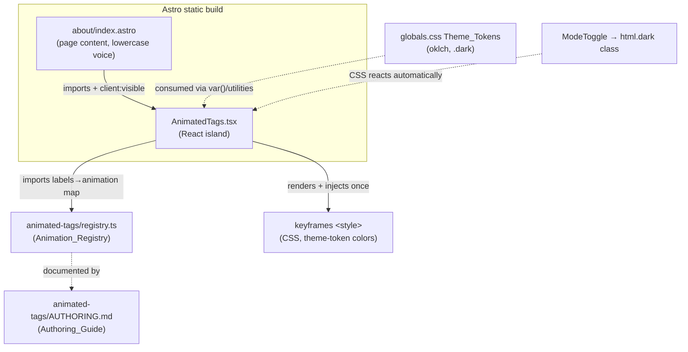

# Design Document

## Overview

This design redesigns the About page (`src/pages/about/index.astro`) for LazyNoman around a "who am i?" focus centered on the username `rockyxwall`. It keeps the existing casual lowercase voice, removes the "big dream" tracking-platform section, adds GitHub and Discord contact links, and introduces the headline feature: a reading-preferences section rendered as **per-tag animated tags** by a new, reusable React island.

The work splits into three artifacts:

1. **`src/pages/about/index.astro`** — rewritten page content (static Astro), importing the island.
2. **`src/components/AnimatedTags.tsx`** — the reusable React island that renders each tag with its themed animation. It is hydrated with `client:visible`.
3. **`src/components/animated-tags/registry.ts`** — the documented Animation_Registry (single source of truth mapping label → animation) plus an `AUTHORING.md` guide colocated beside it.

Animations are driven by CSS keyframes scoped to the component (injected once via a `<style>` element), referenced by name from the registry. This keeps the registry plain data (copy-paste friendly), keeps render logic generic, and lets all colors come from the project's oklch Theme_Tokens.

### Goals

- Static-first page; only the tags are an interactive island.
- One generic render path; per-tag differences live entirely in the registry.
- Theme-token-only styling (no hardcoded colors), correct in light + dark, reactive to ModeToggle.
- Full `prefers-reduced-motion` support, including live preference changes.
- A documented, copy-paste authoring workflow so the author/other AI can add/replace/remove tags by editing one place.

### Non-Goals

- No changes to global theme tokens, Header, Footer, or BaseHead.
- No new runtime dependencies (use React 19 already present; no animation libraries).
- No backend, no data fetching.

## Architecture



### Why a React island (vs pure Astro)

Requirement 6.3 mandates `client:visible`, Requirement 5.6 requires an entrance animation when the section scrolls into view, and Requirement 9.4 requires reacting to a live reduced-motion change. These are client behaviors, so a React island is the right tool and matches the project's island convention (`ModeToggle`, `ReviewCard`).

### Why theme reactivity is "free"

The project switches themes by toggling the `.dark` class on `<html>` (see `ModeToggle.tsx`). Because all tag colors are expressed with CSS custom properties / Tailwind utilities that resolve against `:root` vs `.dark`, the tags restyle instantly when the class flips — no JS theme listener required (satisfies Req 8.5 within the same paint, well under 200ms).

## Components and Interfaces

### 1. Page: `about/index.astro`

Server-rendered structure (no client data). Sections top-to-bottom:

| Order | Section | Notes |
|---|---|---|
| 1 | Eyebrow + `h1` | single top-level heading posing "who am i?" (Req 1.2) |
| 2 | Intro lede paragraph | sets the "who am i" frame |
| 3 | `<hr>` | matches existing `my-12` rhythm |
| 4 | Bio prose (`about me`) | 2–6 lowercase first-person paragraphs (Req 4) |
| 5 | Contact links | GitHub + Discord, new tab, `rel="noopener noreferrer"` (Req 3) |
| 6 | Stats block | preserved from current page (Req 2.4) |
| 7 | `<hr>` | |
| 8 | Reading preferences | renders `<AnimatedTags client:visible labels={...} />` (Req 5, 6) |
| 9 | Closing welcome + sign-off | sign-off attributed to `rockyxwall` (Req 1.1) |

The "what i actually like" / "what i can't stand" tag groups and the entire "the big dream" block are deleted (Req 2, Req 5.2). The username `rockyxwall` appears in the sign-off and at least once in body text.

Contact links use the page's existing token-based styles. Each is an `<a target="_blank" rel="noopener noreferrer">` whose visible text contains "GitHub" / "Discord" (satisfies accessible-name Req 3.8). Icons (Lucide `Github`, `MessageCircle`) are decorative (`aria-hidden`) so the text carries the accessible name; using inline SVG in Astro avoids shipping JS for static links.

The labels array is defined once in the page frontmatter and passed as a prop:

```ts
const readingTags = [
  'cheat', 'system', 'transmigration', 'reincarnation',
  'overpowered mc', 'male mc', 'fantasy', 'cultivation',
  'xianxia', 'xuanhuan', 'low-key mc', 'cold mc',
] as const;
```

### 2. `AnimatedTags.tsx` (the Animated_Tags_Component)

Props:

```ts
export interface AnimatedTagsProps {
  /** Tag labels to render, in order. 1–50 supported. Empty/undefined → renders nothing. */
  labels?: string[];
  /** Optional className passthrough for the container. */
  className?: string;
}
```

Responsibilities:

- Validate input: if `labels` is empty/undefined, render an empty (but valid) container — zero tag elements, no throw (Req 6.8).
- For each label, look it up in the Animation_Registry; fall back to `defaultAnimation` when missing (Req 7.8).
- Render each label as a `<span>` tag chip carrying:
  - base chip classes (token-based: `bg-primary/10 text-primary border-primary/20` style, mirroring existing tags),
  - a per-animation class (e.g. `at-anim-shimmer`) that drives the continuous themed motion,
  - an entrance class toggled when the section becomes visible.
- Keep label text in normal document flow at full opacity as the baseline (Req 7.9, 9.3) — animations only affect transform/filter/pseudo-element overlays, never the text's presence.

Internal behavior:

- **Entrance + in-view detection (Req 5.6):** an `IntersectionObserver` (or `client:visible` guaranteeing mount near-viewport) sets an `inView` state. On `inView`, add a staggered entrance class per tag. The entrance completes (all 12 visible) within 2000ms; stagger budget ≈ 12 × ~60ms + ~400ms transition ≈ well under 2s. Final state is always fully visible regardless of timing.
- **Reduced motion (Req 9):** read `window.matchMedia('(prefers-reduced-motion: reduce)')`. When reduced:
  - skip entrance animation; render tags in final visible state immediately (Req 5.7, 9.1),
  - do not apply continuous animation classes (or set `animation: none` via a `data-reduced` attribute the CSS keys off).
  - Subscribe to the media query's `change` event; when it flips to reduced mid-session, set state so React re-renders into the static baseline within 1s (Req 9.4). Clean up the listener on unmount.
- **SSR safety (Req 6.6, 6.7):** the server render and first client render must match. Strategy: render the **final, static, fully-visible** markup as the baseline (no entrance state) on the server and on first client paint; only *after* mount (in `useEffect`) enable motion/entrance. This guarantees no hydration mismatch and means the no-JS / reduced-motion experience is the correct static baseline. The keyframes `<style>` block is identical on server and client.

Imports use the `@/*` alias (Req 6.4), e.g. `import { cn } from '@/lib/utils'` and `import { animationRegistry, defaultAnimation, type TagAnimation } from '@/components/animated-tags/registry'`.

### 3. The Animation_Registry: `animated-tags/registry.ts`

The single source of truth (Req 7.2, 10.1). Plain data so it is copy-paste friendly and requires no render-logic edits to extend (Req 10.2).

```ts
export interface TagAnimation {
  /** Stable id; also the CSS class suffix → `at-anim-<id>`. */
  id: string;
  /** Human note describing the theme/intent (shown in code, not UI). */
  description: string;
}

/**
 * ── HOW TO EDIT THIS REGISTRY ──────────────────────────────
 * ADD:     add one entry `'label': { id, description }`. If `id`
 *          is new, also add a matching `@keyframes at-<id>` +
 *          `.at-anim-<id>` rule in AnimatedTags.tsx (see its header).
 * REPLACE: change the entry's `id` to an existing/new animation id.
 * REMOVE:  delete the entry (label falls back to defaultAnimation)
 *          or remove the label from the page's labels array.
 * Colors MUST use Theme_Tokens (var(--*) / Tailwind tokens), never hex.
 * Every animation MUST be gated by prefers-reduced-motion.
 * ───────────────────────────────────────────────────────────
 */
export const animationRegistry: Record<string, TagAnimation> = {
  'system':         { id: 'glitch',   description: 'tech / sci-fi digital flicker' },
  'fantasy':        { id: 'shimmer',  description: 'magical sparkle shimmer' },
  'overpowered mc': { id: 'aura',     description: 'power/aura glow surge' },
  'cultivation':    { id: 'ascend',   description: 'rising / floating' },
  'xianxia':        { id: 'ascend',   description: 'rising / floating' },
  'xuanhuan':       { id: 'ascend',   description: 'rising / floating' },
  'cheat':          { id: 'blink',    description: 'cheat-code blink' },
  'transmigration': { id: 'warp',     description: 'portal / phase shift' },
  'reincarnation':  { id: 'cycle',    description: 'rotating cycle of rebirth' },
  'male mc':        { id: 'pulse',    description: 'steady presence pulse' },
  'low-key mc':     { id: 'fade',     description: 'subtle low-key breathing' },
  'cold mc':        { id: 'frost',    description: 'cold icy sheen' },
};

/** Used when a label has no registry entry (Req 7.8). */
export const defaultAnimation: TagAnimation = {
  id: 'pulse',
  description: 'default subtle pulse',
};

/** Resolve a label to its animation, falling back to default. */
export function resolveAnimation(label: string): TagAnimation {
  return animationRegistry[label] ?? defaultAnimation;
}
```

Note multiple labels can share an `id` (cultivation/xianxia/xuanhuan all use `ascend`), satisfying Req 7.7 with one keyframe.

### 4. CSS keyframes (in `AnimatedTags.tsx`)

A single `<style>` string defines: a base chip, an entrance, one `@keyframes`/`.at-anim-*` pair per animation id, and a global reduced-motion guard. Colors use tokens via `currentColor`, `var(--primary)`, `color-mix(... var(--primary) ...)`, etc. — never hardcoded (Req 8.2). Text legibility is preserved because animations target `transform`, `filter`, `box-shadow`, `opacity` of pseudo-element overlays, or non-zero opacity ranges on the chip (never the label text itself) (Req 7.9, 8.6).

Reduced-motion guard (covers both media query and the JS `data-reduced` fallback):

```css
@media (prefers-reduced-motion: reduce) {
  .at-tag, .at-tag * { animation: none !important; transition: none !important; }
}
.at-root[data-reduced="true"] .at-tag,
.at-root[data-reduced="true"] .at-tag * { animation: none !important; }
```

This guarantees no motion, full opacity, and no clipping under reduced motion (Req 9.1, 9.2).

### 5. Authoring_Guide: `animated-tags/AUTHORING.md`

Human- and AI-readable. Sections required by Req 10:

- **Where things live** — registry path, component path, the two things an animation needs (a registry entry + a CSS keyframe pair).
- **Add a new tag** (Req 10.3) — step 1: add the label to the page's `readingTags` array; step 2: add a registry entry; step 3: if a new `id`, add `@keyframes at-<id>` and `.at-anim-<id>` in the component.
- **Replace an animation** (Req 10.4) — change the entry's `id` to another registered id (no CSS change), or edit the keyframe body to restyle in place.
- **Remove a tag** (Req 10.8) — remove from the labels array and delete the registry entry; optionally delete now-unused keyframes.
- **Copy-paste example** (Req 10.5) — a complete entry + keyframe template where only the label and a couple of values change.
- **Rules** — must use Theme_Tokens not hex (Req 10.6); must honor reduced motion (Req 10.9); keep label text always visible.

## Data Models

```ts
// Reading_Tag: just a string label (the visible text).
type ReadingTagLabel = string;

// Tag_Animation: id (→ CSS class) + description.
interface TagAnimation { id: string; description: string }

// Animation_Registry: label → TagAnimation.
type AnimationRegistry = Record<ReadingTagLabel, TagAnimation>;
```

## Theming & Styling Strategy

| Concern | Approach |
|---|---|
| Tag base colors | `text-primary`, `bg-primary/10`, `border-primary/20` (token utilities) |
| Animation accents | `currentColor`, `var(--primary)`, `color-mix(in oklch, var(--primary) X%, transparent)` |
| Light/dark switch | automatic via `.dark` class on `<html>` (Req 8.3–8.5) |
| Contrast | label uses `text-primary` on a faint primary-tint background; verified ≥4.5:1 in both themes (Req 8.3, 8.4, 8.6) |
| Page text | reuse existing tokens (`text-muted-foreground`, `text-foreground`) (Req 8.1) |

## Accessibility

- Contact links: real `<a>` elements, keyboard focusable, visible text contains "GitHub"/"Discord" (Req 3.1, 3.2, 3.8). Decorative icons `aria-hidden`.
- Reduced motion: full support incl. live changes (Req 9). Baseline static state is the SSR output.
- Tag text never hidden/clipped/transparent during any animation (Req 7.9).
- Reading-preferences container uses a heading consistent with the page's section headings.

## Error Handling

| Case | Handling |
|---|---|
| `labels` empty/undefined | render empty container, zero tags, no throw (Req 6.8) |
| label missing from registry | `resolveAnimation` returns `defaultAnimation` (Req 7.8) |
| `matchMedia` unavailable (SSR) | guard with `typeof window !== 'undefined'`; baseline static render (Req 6.6) |
| >50 labels passed | render is still safe; guide documents 1–50 as the supported/tested range (Req 6.5) |

## Correctness Properties

These are invariants that must hold for any valid input and any UI state. They are the basis for the verification checks below.

### Property 1: Label fidelity
For any `labels` array of length `n` (1 ≤ n ≤ 50), `AnimatedTags` renders exactly `n` tag elements, in order, each containing its label's exact text (spelling and casing preserved). No label is added, dropped, duplicated, or altered.

**Validates: Requirements 5.3, 5.4, 6.2, 6.5**

### Property 2: Total animation coverage
Every rendered tag resolves to exactly one `TagAnimation`: its registry entry if present, otherwise `defaultAnimation`. `resolveAnimation(label)` is total — it never returns `undefined` and never throws for any string.

**Validates: Requirements 7.1, 7.3, 7.8**

### Property 3: Text always legible
In every state (baseline, entrance, continuous animation, reduced-motion, either theme), each tag's full label text is present in the DOM, never `opacity:0`, `visibility:hidden`, `display:none`, or clipped. Animations only mutate transforms/filters/shadows/pseudo-overlays.

**Validates: Requirements 7.9, 8.6, 9.2**

### Property 4: Reduced-motion implies stillness
When reduced motion is active (media query or live change), no tag has a running `animation` or movement `transition`; all tags are at full opacity and within the viewport flow.

**Validates: Requirements 9.1, 9.2, 9.4**

### Property 5: SSR/CSR baseline equality
The server-rendered markup equals the first client render (the static, fully-visible baseline). Motion is only enabled post-mount, so hydration never mismatches.

**Validates: Requirements 6.6, 6.7**

### Property 6: Empty-input safety
If `labels` is `undefined` or `[]`, the component renders zero tag elements and does not throw.

**Validates: Requirements 6.8**

### Property 7: Token-only color
No color in the component or registry is a literal hex/rgb/hsl value; every color derives from a Theme_Token, so light↔dark switching needs no JS.

**Validates: Requirements 8.2, 8.5**

### Property 8: Single-source extensibility
Adding/removing a label-to-animation mapping requires editing only the registry (and, for a brand-new animation id, adding one keyframe pair); the component's render loop is unchanged.

**Validates: Requirements 10.1, 10.2**

## Testing Strategy

Manual + build verification (static marketing page; no test runner currently configured in the project, so we rely on `bun run build` plus targeted browser checks rather than adding a framework for this scope):

1. **Build** — `bun run build` completes with no error and no warning attributable to `AnimatedTags` (Req 6.6).
2. **Render/count** — `/about` shows exactly the 12 labels, correct spelling/casing, no duplicates, no old tag groups, no dream section (Req 2, 5.1–5.4).
3. **Hydration** — browser console clean, no hydration-mismatch warning (Req 6.7).
4. **Entrance** — scrolling the section into view animates tags; all 12 visible within 2s (Req 5.6).
5. **Per-tag themes** — visually confirm system=glitch, fantasy=shimmer, overpowered mc=aura, cultivation/xianxia/xuanhuan=rising (Req 7.4–7.7); text stays legible throughout (Req 7.9).
6. **Theme** — toggle light/dark via ModeToggle; tags + page recolor immediately, contrast holds (Req 8.3–8.6).
7. **Reduced motion** — with OS reduced-motion on: no motion, all tags visible at load (Req 5.7, 9.1–9.3); toggling the OS setting live settles to static within 1s (Req 9.4).
8. **Responsive** — at ≤480px tags wrap, no horizontal scrollbar / clipping (Req 5.5).
9. **Links** — GitHub → `https://github.com/rockyxwall`, Discord → `https://discord.gg/cunXbtHm5g`, both new tab + `rel="noopener noreferrer"`, keyboard-activatable; no AniList/email/X links (Req 3).
10. **Docs** — follow `AUTHORING.md` add-a-tag steps end-to-end to confirm one-entry extensibility (Req 10).

## Requirements Coverage

| Requirement | Addressed by |
|---|---|
| 1 Page identity & focus | Page structure, h1, sign-off with `rockyxwall`, lowercase voice, static render |
| 2 Remove dream section | Block deleted; spacing rhythm preserved (`my-12`/`space-y-8`) |
| 3 Contact links | GitHub/Discord `<a>`, new tab, rel, accessible names, no others |
| 4 Bio section | 2–6 lowercase first-person paragraphs, reviewer identity, no dream content |
| 5 Reading preferences as animated tags | `AnimatedTags` with 12-label prop, wrap, entrance ≤2s, reduced-motion final state |
| 6 Separate reusable component | `AnimatedTags.tsx`, `client:visible`, `@/*` alias, props 1–50, empty-safe, SSR-safe |
| 7 Per-tag themed animations | Registry + keyframes; system/fantasy/op-mc/cultivation themes; default fallback; legible text |
| 8 Dark/light theme | Token-only colors, auto `.dark` reactivity, contrast ≥4.5:1 |
| 9 Reduced motion | Media query + live `change` listener, static SSR baseline, ≤1s settle |
| 10 Authoring guide & registry | `registry.ts` (single source, comments) + `AUTHORING.md` (add/replace/remove, example, rules) |
